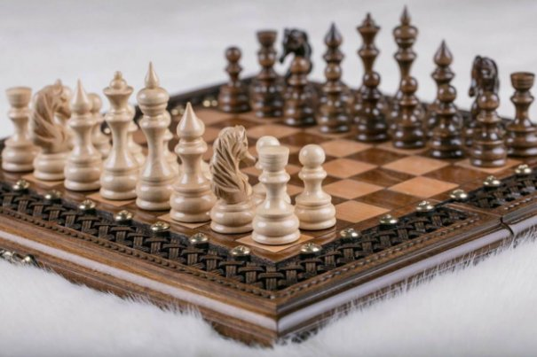
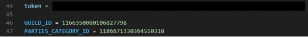
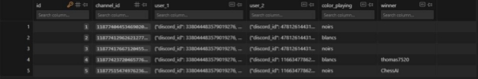

Groupe : EchecScolaire

Membres : *Thomas G\*\*\*\*\* / Axel B\*\*\*\*\* / Maxime F\*\*\*\*\* Ch\*\*\*\*\**

Année : Novembre 2024 -> Decembre 2024

Projet de fin de module : Jeu d’échec Discord

Librairies requises :

- pip Install -U discord.py
- pip install aspose-words
- pip install chess
- pip install sqlite3

Lien discord permanent (si besoin) : <https://discord.gg/xtTF5Xma>

Si vous voulez essayez le bot sur un autre serveur, il faudra alors changer les constantes suivantes dans la class ChessDiscord.Py :

- GUILD\_ID
- PARTIES\_CATEGORY\_ID
- Ensuite, il faudra décommenter la ligne 32 :

Lancer le bot, l'éteindre, remettre en commentaire puis le relancer afin de synchroniser les commandes sur votre serveur.

- Pour lancer le bot, il suffit de run le fichier ChessDiscord.py

*Vous devez mettre le token de votre propre bot.*

Remarque : hormis les commandes utilisables uniquement en partie, les       commandes /play et /help peuvent être utilisés partout (le /play ne peut pas être utilisé en partie). Si vous souhaitez définir des restrictions, il suffira de le    faire par vous-mêmes dans les paramètres du serveur, intégrations puis ChessIA dans la catégorie commandes.

Protocolede communication avec le bot

La communication avec le bot est réalisée avec la librairie python discord.py, et l’interaction entre joueur et bot se fait uniquement par commandes

Commentjouer?

/help pour afficher la liste des commandes.

Pour lancer un 1v1 ou jouer contre l’IA, il faut faire /play <adversaire>

Lors d'unepartie:

- /abandonner => pour abandonner la partie. La victoire revient à l'adversaire.
- /deplacer <case> <case\_cible> => pour déplacer une pièce d'un point A à un point B.
- /mouvements <case> => afficher les mouvements possibles d'une pièce
- /promotion <case> <case\_cible> <type> => Permet de promouvoir une pièce d'un point A à un point B

Les différentes classes:

-La class ChessDiscord.py permet de lancer le bot, charger les parties en cours de la base de données.

-La class ChessGame.py regroupe les fonctionnalités du jeu d'échec.

-La class ChessSQL.py contient les fonctions utilisées pour manipuler la base de données.

-La class Pieces.py contient les pièces (Object) utilisés dans notre échiquier (cf ChessGame.py)

Démarche :

Ce qui a été fait:

-Création du serveur et du bot discord. L’invité, puis installation de l’environnement discord sur python via la librairie ‘discord.py’.

-La seconde étape a été de créer l’échiquier via une matrice 8\*8 comportant les pièces (via Object) et les cases vides représentés par des “.”.

-réflexion des algorithmes permettant de prévoir/réaliser les mouvements des pièces (Ex : Pion, Tour,Dame, Fou, Roi, Cavalier)

-création de l’image de l’échiquier importer de l’api chess pour générer le fichier SVG puis converti en PNG pour être envoyé sur discord

- Création du système de sauvegarde qui permet de relancer une partie au même endroit si le bot est relancé / a crash. Les parties sauvegardées peuvent être utilisés afin d’établir un classement, des statistiques, etc…

  -Implémentation des algorithmes de mise en échec, détection échec et mat, le Roque et le système de promotion

  -Création de L’IA random si le bot peut mettre en échec il doit mettre en échec sinon il joue un mouvement au hasard. S'il est mis en échec, il est capable de s’en sortir. Il peut aussi promouvoir un pion lorsque qu’il le peut.

  -Seuls les personnes jouant peuvent écrire dans le salon. Le reste peut tout de même regarder le match.

  Ce qui n’apas été fait :

- Création de l’IA min max capable d’évaluer le meilleur coup à faire
- Un système propre pour l’envoie des images pendant une partie (potentiellement via un temp file)

  Exemple d’un début d’une partie contre l’IA :

1. Utilisation de la commande /play @ChessAI

2. Je clique sur le lien menant au salon, soit c’est moi qui ai été choisi pour jouer en premier (les blancs) ou alors le bot commence à jouer. (Dans notre cas, le bot était le premier à commencer.) L’échiquier se retourne ensuite lors du tour suivant.

3. Je décide de faire soit /mouvements <case> pour afficher les mouvements disponibles d’une pièce ou alors je déplace directement la pièce à l’endroit souhaité en utilisant /deplacer <case\_piece>

<case\_cible>               Exemple : /mouvementsG2

Exemple : /deplacer G2 G3

Le bot finit par répondre en jouant à son tour, et ainsi de suite. Si vous souhaitez abandonner la partie, vous pouvez utiliser la commande /abandonner.

Pour le début d’une partie contre un joueur, c’est exactement la même démarche, mais vous utilisez la commande /play <adversaire> puis vous jouez chacun votre tour jusqu’à ce qu’une personne gagne ou abandonne.

Lorsqu’une partie est terminée, le salon reste présent, mais plus personne ne peut parler dans le salon. (On pourrait penser à un système de sauvegarde en html par exemple.)

Base de données :

Notre base de données est découpée en 2 tables :

Games

Toutes les parties sont enregistrés, et permettent la restauration d’une partie en cours lorsque le bot redémarre / crash. Elle pourrait permettre d’établir un historique, un classement voir des statistiques.

Chessboard

Les échiquiers des parties sont sauvegardés ici. On utilise cette table afin de reconstruire l’échiquier lorsque le bot redémarre / crash.
EchecScolaire Page 8 sur 8 2023/2024
